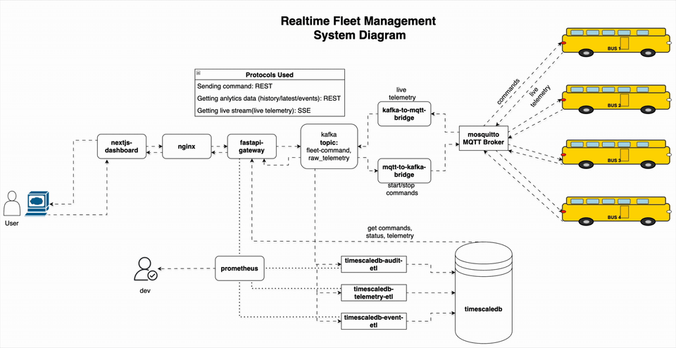

# Fleet Management System

Fleet Management System is a local, containerized, event-driven transit operations platform for simulating fleet behavior, issuing bus control commands, and observing live operational health end to end.

It is designed to help teams test operational workflows in a realistic environment: command dispatch, telemetry streaming, persistence, dashboard visualization, and monitoring/alerting.

It includes:

- MQTT-based simulator control + telemetry
- Kafka event backbone
- FastAPI gateway (REST + SSE)
- TimescaleDB ETL pipelines (telemetry, events, command audit)
- Next.js operations dashboard
- Prometheus metrics and alerting

## What this system lets you do

- Control each bus via commands such as `START`, `PAUSE`, `STOP`, and `RESTART`.
- Receive live telemetry updates over SSE and APIs.
- Track operational state per bus, including:
	- vehicle status (`IDLE`, `RUNNING`, `PAUSED`)
	- GPS position (`lat`, `lon`)
	- speed
	- direction (`FORWARD`/`RETURN`)
	- route progress (`0` to `1`)
	- completed trip count (`full_trips`)
	- stop context (`at_stop`, `current_stop`, `next_stop`)
- Persist telemetry/events/audit trails in TimescaleDB for history and analysis.

## Why the architecture is robust

- **Event-driven decoupling with Kafka:** producers and consumers are separated, so services can evolve, restart, or scale independently.
- **Reduced single point of failure risk:** the system avoids tight direct coupling between simulator, API, storage, and UI layers.
- **Graceful maintenance windows:** individual components can be restarted or updated without taking down the entire platform.
- **Replayable and durable data flow:** buffered event streams improve resiliency during transient consumer outages.
- **Operational visibility by design:** Prometheus metrics + logs + API health checks support production-style monitoring and incident response.

---

## Architecture at a glance

1. Simulator(4 Bus in Fixed Route) publishes telemetry to MQTT.
2. MQTT→Kafka bridge forwards telemetry into Kafka topics.
3. ETL workers consume Kafka and persist into TimescaleDB tables.
4. FastAPI reads from TimescaleDB for operational APIs and consumes telemetry stream for live SSE.
5. Next.js dashboard calls REST endpoints and subscribes to SSE for real-time updates.

---

## Visual demos

### System Design Diagram



Source video: [output/system_design_diagram.mov](output/system_design_diagram.mov)

### UI walkthrough (full preview)


Source video: [output/ui_visuals.mov](output/ui_visuals.mov)

---

## Prerequisites

- Docker Desktop (or Docker Engine + Compose v2)
- At least 6 GB RAM available for containers
- Ports available on host:
	- `3000` (Next.js)
	- `8080` (Nginx / API)
	- `9090` (Prometheus)
	- `9094` (Kafka external listener)
	- `5433` (TimescaleDB)
	- `1884` / `9002` (MQTT TCP / WS)

---

## Quick start

### 1) Clone and enter project
```bash
git clone https://github.com/NuhashHaque/Fleet-Management-System.git
cd Fleet-Management-System
```

### 2) Start full stack
```bash
docker compose up --build -d
```

### 3) Check service status
```bash
docker compose ps
```

### 4) Open core endpoints
- Next.js dashboard: http://localhost:3000
- API/SSE via Nginx: http://localhost:8080
- Prometheus: http://localhost:9090
- Kafka external listener: localhost:9094
- TimescaleDB: localhost:5433

---

## Day-to-day Docker commands

### Start existing containers
```bash
docker compose start
```

### Stop containers (keep data)
```bash
docker compose stop
```

### Restart everything
```bash
docker compose restart
```

### Rebuild and restart
```bash
docker compose up --build -d
```

### Follow logs
```bash
docker compose logs -f
```

### Follow one service log
```bash
docker compose logs -f fastapi-gateway
```

---

## Shutdown / cleanup options

### Stop and remove containers + networks (keep volumes)
```bash
docker compose down
```

### Stop and remove everything including volumes
```bash
docker compose down -v
```

### Full cleanup including local images built by compose
```bash
docker compose down -v --rmi local
```

> Use the last two carefully; they remove persisted local data.

---

## Operational controls

### Enable/start v2 cutover services
```bash
./scripts/cutover_start_v2.sh
```

### Rollback to legacy-safe mode
```bash
./scripts/cutover_rollback_legacy.sh
```

Legacy-safe mode keeps only:

- `mosquitto`
- `simulator`
- `nextjs-dashboard`
- `nginx`

---

## API protocol map (current setup)

- **Send command:** REST `POST /api/command`
- **Read dashboard data:** REST `GET /api/ops/telemetry/*`, `GET /api/ops/events`
- **Live telemetry stream:** SSE `GET /sse/telemetry`


---

## Troubleshooting

### Dashboard shows API 502 errors
Usually an upstream proxy mismatch after container restart.

```bash
docker compose restart nginx fastapi-gateway
docker compose ps
```

Then verify:

```bash
curl -i "http://localhost:8080/api/ops/telemetry/latest?limit=4"
curl -i "http://localhost:8080/api/ops/events?limit=30"
```

### Data not updating in dashboard
Check ETL + bridge services:

```bash
docker compose logs -f mqtt-to-kafka-bridge kafka-to-mqtt-bridge timescaledb-telemetry-etl timescaledb-event-etl timescaledb-audit-etl
```

### Kafka topic inspection
```bash
docker exec fleet_kafka kafka-topics --bootstrap-server localhost:9092 --list
docker exec fleet_kafka kafka-topics --bootstrap-server localhost:9092 --describe --topic fleet-commands
docker exec fleet_kafka kafka-topics --bootstrap-server localhost:9092 --describe --topic raw-telemetry
```

---


## Contributing

1. Create a feature branch.
2. Keep changes scoped and include validation notes.
3. Open a PR with logs/screenshots when behavior changes are user-visible.

---

## License

This project is licensed under the MIT License. See [LICENSE](LICENSE).
